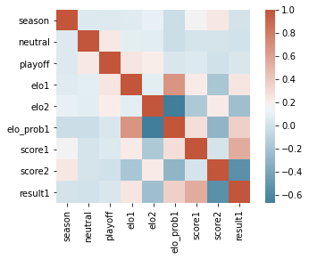

# Project 4 - Regression
### Author: Jace Kline

## Objective
The ultimate goal of this project is to build one or more regression models to predict the scores for each team (for each game) using the other columns as features.


```python
# General imports
import re
import numpy as np
import pandas as pd
from matplotlib import pyplot as plt
%matplotlib inline
```

### Loading the Data


```python
df = pd.read_csv('../data/initial/nfl_games.csv')
df['result1'] = df['result1'].astype(np.short)
df.head()
```


<div>
<style scoped>
    .dataframe tbody tr th:only-of-type {
        vertical-align: middle;
    }

    .dataframe tbody tr th {
        vertical-align: top;
    }

    .dataframe thead th {
        text-align: right;
    }
</style>
<table border="1" class="dataframe">
  <thead>
    <tr style="text-align: right;">
      <th></th>
      <th>date</th>
      <th>season</th>
      <th>neutral</th>
      <th>playoff</th>
      <th>team1</th>
      <th>team2</th>
      <th>elo1</th>
      <th>elo2</th>
      <th>elo_prob1</th>
      <th>score1</th>
      <th>score2</th>
      <th>result1</th>
    </tr>
  </thead>
  <tbody>
    <tr>
      <th>0</th>
      <td>1920-09-26</td>
      <td>1920</td>
      <td>0</td>
      <td>0</td>
      <td>RII</td>
      <td>STP</td>
      <td>1503.947</td>
      <td>1300.000</td>
      <td>0.824651</td>
      <td>48</td>
      <td>0</td>
      <td>1</td>
    </tr>
    <tr>
      <th>1</th>
      <td>1920-10-03</td>
      <td>1920</td>
      <td>0</td>
      <td>0</td>
      <td>AKR</td>
      <td>WHE</td>
      <td>1503.420</td>
      <td>1300.000</td>
      <td>0.824212</td>
      <td>43</td>
      <td>0</td>
      <td>1</td>
    </tr>
    <tr>
      <th>2</th>
      <td>1920-10-03</td>
      <td>1920</td>
      <td>0</td>
      <td>0</td>
      <td>RCH</td>
      <td>ABU</td>
      <td>1503.420</td>
      <td>1300.000</td>
      <td>0.824212</td>
      <td>10</td>
      <td>0</td>
      <td>1</td>
    </tr>
    <tr>
      <th>3</th>
      <td>1920-10-03</td>
      <td>1920</td>
      <td>0</td>
      <td>0</td>
      <td>DAY</td>
      <td>COL</td>
      <td>1493.002</td>
      <td>1504.908</td>
      <td>0.575819</td>
      <td>14</td>
      <td>0</td>
      <td>1</td>
    </tr>
    <tr>
      <th>4</th>
      <td>1920-10-03</td>
      <td>1920</td>
      <td>0</td>
      <td>0</td>
      <td>RII</td>
      <td>MUN</td>
      <td>1516.108</td>
      <td>1478.004</td>
      <td>0.644171</td>
      <td>45</td>
      <td>0</td>
      <td>1</td>
    </tr>
  </tbody>
</table>
</div>


## Data Exploration
Let us now observe some statistics and correlation patterns in our dataset.

### Understanding the Features
<table>
    <tr>
        <th>Feature</th>
        <th>Description</th>
    </tr>
    <tr>
        <td>neutral</td>
        <td>Value of 1 if the game was played at a netural site, 0 otherwise</td>
    </tr>
    <tr>
        <td>playoff</td>
        <td>Value of 1 if the game was a playoff game, 0 otherwise</td>
    </tr>
    <tr>
        <td>elo1</td>
        <td>The ELO score of the home team</td>
    </tr>
    <tr>
        <td>elo2</td>
        <td>The ELO score of the away team</td>
    </tr>
    <tr>
        <td>elo_prob1</td>
        <td>The "expected score" of team 1 on a scale of 0 to 1, dependent on the discrepancy in ELO ratings</td>
    </tr>
    <tr>
        <td>score1</td>
        <td>The points scored by team 1 (home team)</td>
    </tr>
    <tr>
        <td>score2</td>
        <td>The points scored by team 2 (away team)</td>
    </tr>
    <tr>
        <td>result1</td>
        <td>Value 1 if team 1 wins, otherwise value 0</td>
    </tr>
</table>

### Statistics
Below, we show the table of common statistical measures for our data.


```python
# show statistics
df.describe()
```


<div>
<style scoped>
    .dataframe tbody tr th:only-of-type {
        vertical-align: middle;
    }

    .dataframe tbody tr th {
        vertical-align: top;
    }

    .dataframe thead th {
        text-align: right;
    }
</style>
<table border="1" class="dataframe">
  <thead>
    <tr style="text-align: right;">
      <th></th>
      <th>season</th>
      <th>neutral</th>
      <th>playoff</th>
      <th>elo1</th>
      <th>elo2</th>
      <th>elo_prob1</th>
      <th>score1</th>
      <th>score2</th>
      <th>result1</th>
    </tr>
  </thead>
  <tbody>
    <tr>
      <th>count</th>
      <td>16274.000000</td>
      <td>16274.000000</td>
      <td>16274.000000</td>
      <td>16274.000000</td>
      <td>16274.000000</td>
      <td>16274.000000</td>
      <td>16274.000000</td>
      <td>16274.000000</td>
      <td>16274.000000</td>
    </tr>
    <tr>
      <th>mean</th>
      <td>1982.437569</td>
      <td>0.005223</td>
      <td>0.034779</td>
      <td>1502.458394</td>
      <td>1498.918375</td>
      <td>0.584829</td>
      <td>21.544058</td>
      <td>18.578161</td>
      <td>0.571034</td>
    </tr>
    <tr>
      <th>std</th>
      <td>25.448049</td>
      <td>0.072084</td>
      <td>0.183226</td>
      <td>105.015371</td>
      <td>104.541271</td>
      <td>0.175302</td>
      <td>11.289422</td>
      <td>10.794566</td>
      <td>0.494944</td>
    </tr>
    <tr>
      <th>min</th>
      <td>1920.000000</td>
      <td>0.000000</td>
      <td>0.000000</td>
      <td>1119.595000</td>
      <td>1156.551000</td>
      <td>0.070953</td>
      <td>0.000000</td>
      <td>0.000000</td>
      <td>0.000000</td>
    </tr>
    <tr>
      <th>25%</th>
      <td>1967.000000</td>
      <td>0.000000</td>
      <td>0.000000</td>
      <td>1429.242750</td>
      <td>1425.864750</td>
      <td>0.461231</td>
      <td>14.000000</td>
      <td>10.000000</td>
      <td>0.000000</td>
    </tr>
    <tr>
      <th>50%</th>
      <td>1987.000000</td>
      <td>0.000000</td>
      <td>0.000000</td>
      <td>1504.015000</td>
      <td>1500.185000</td>
      <td>0.596354</td>
      <td>21.000000</td>
      <td>17.000000</td>
      <td>1.000000</td>
    </tr>
    <tr>
      <th>75%</th>
      <td>2003.000000</td>
      <td>0.000000</td>
      <td>0.000000</td>
      <td>1578.071500</td>
      <td>1575.753000</td>
      <td>0.719930</td>
      <td>28.000000</td>
      <td>26.000000</td>
      <td>1.000000</td>
    </tr>
    <tr>
      <th>max</th>
      <td>2018.000000</td>
      <td>1.000000</td>
      <td>1.000000</td>
      <td>1839.663000</td>
      <td>1849.484000</td>
      <td>0.970516</td>
      <td>72.000000</td>
      <td>73.000000</td>
      <td>1.000000</td>
    </tr>
  </tbody>
</table>
</div>


### Correlations
Let us display a heat map of the correlations between each of the features.


```python
df.corr()
```


<div>
<style scoped>
    .dataframe tbody tr th:only-of-type {
        vertical-align: middle;
    }

    .dataframe tbody tr th {
        vertical-align: top;
    }

    .dataframe thead th {
        text-align: right;
    }
</style>
<table border="1" class="dataframe">
  <thead>
    <tr style="text-align: right;">
      <th></th>
      <th>season</th>
      <th>neutral</th>
      <th>playoff</th>
      <th>elo1</th>
      <th>elo2</th>
      <th>elo_prob1</th>
      <th>score1</th>
      <th>score2</th>
      <th>result1</th>
    </tr>
  </thead>
  <tbody>
    <tr>
      <th>season</th>
      <td>1.000000</td>
      <td>0.049405</td>
      <td>0.058257</td>
      <td>0.064440</td>
      <td>0.105210</td>
      <td>-0.026225</td>
      <td>0.189312</td>
      <td>0.240302</td>
      <td>0.013406</td>
    </tr>
    <tr>
      <th>neutral</th>
      <td>0.049405</td>
      <td>1.000000</td>
      <td>0.232839</td>
      <td>0.082937</td>
      <td>0.078358</td>
      <td>-0.029673</td>
      <td>0.016443</td>
      <td>0.017205</td>
      <td>0.002518</td>
    </tr>
    <tr>
      <th>playoff</th>
      <td>0.058257</td>
      <td>0.232839</td>
      <td>1.000000</td>
      <td>0.254656</td>
      <td>0.208672</td>
      <td>0.036233</td>
      <td>0.047683</td>
      <td>-0.002400</td>
      <td>0.035775</td>
    </tr>
    <tr>
      <th>elo1</th>
      <td>0.064440</td>
      <td>0.082937</td>
      <td>0.254656</td>
      <td>1.000000</td>
      <td>0.084355</td>
      <td>0.673504</td>
      <td>0.222872</td>
      <td>-0.181284</td>
      <td>0.253020</td>
    </tr>
    <tr>
      <th>elo2</th>
      <td>0.105210</td>
      <td>0.078358</td>
      <td>0.208672</td>
      <td>0.084355</td>
      <td>1.000000</td>
      <td>-0.670226</td>
      <td>-0.167704</td>
      <td>0.219096</td>
      <td>-0.227647</td>
    </tr>
    <tr>
      <th>elo_prob1</th>
      <td>-0.026225</td>
      <td>-0.029673</td>
      <td>0.036233</td>
      <td>0.673504</td>
      <td>-0.670226</td>
      <td>1.000000</td>
      <td>0.285291</td>
      <td>-0.295792</td>
      <td>0.355976</td>
    </tr>
    <tr>
      <th>score1</th>
      <td>0.189312</td>
      <td>0.016443</td>
      <td>0.047683</td>
      <td>0.222872</td>
      <td>-0.167704</td>
      <td>0.285291</td>
      <td>1.000000</td>
      <td>0.019117</td>
      <td>0.544358</td>
    </tr>
    <tr>
      <th>score2</th>
      <td>0.240302</td>
      <td>0.017205</td>
      <td>-0.002400</td>
      <td>-0.181284</td>
      <td>0.219096</td>
      <td>-0.295792</td>
      <td>0.019117</td>
      <td>1.000000</td>
      <td>-0.541786</td>
    </tr>
    <tr>
      <th>result1</th>
      <td>0.013406</td>
      <td>0.002518</td>
      <td>0.035775</td>
      <td>0.253020</td>
      <td>-0.227647</td>
      <td>0.355976</td>
      <td>0.544358</td>
      <td>-0.541786</td>
      <td>1.000000</td>
    </tr>
  </tbody>
</table>
</div>


```python
# import the seaborn library to plot correlation map
import seaborn as sns
```


```python
def correlation_grid(corr):
    # Create custom color palette
    corr_cmap = sns.diverging_palette(230, 20, as_cmap=True)

    # Show the correlation map
    sns.heatmap(corr, cmap = corr_cmap, square=True)
```


```python
correlation_grid(df.corr())
```





### Correlation Analysis
From the above figure, we can pick out some key observations...
* 'result1' and 'score2' have correlation of about -0.54
   - This implies that if team 1 wins, team 2 tends to score fewer points
* 'result1' and 'score1' have correlation of roughly 0.54
   - This implies that if team 1 wins, team 1 tends to score more points
* 'elo_prob1' and 'elo2' have correlation of -0.67
   - This is because the 'elo_prob1' measure is inherently dependent on the difference between elo1 and elo2
* 'elo_prob1' and 'elo1' have correlation of 0.67
   - Once again, because 'elo_prob1' is dependent on 'elo1' by definition

## Feature Engineering Ideas

### Idea 1: Team Analysis by Year
The general idea of our feature engineering shall be to put concrete "anchors" on team scoring expectations. The original dataset has comprehensive information regarding the relational aspect of how two teams should stack up, but this lacks any inspection of the team scoring trends themselves. This leads us to group the data by team (per season) and find the following for each team:
1. Average points scored
2. Average points allowed
These features shall allow us to gain perspective on the actual quantity of points each team is scoring, which shall help our model more accurately predict the number of points a team should score in any given game.

#### Calculating average points scored by each team during each season


```python
df_scores = df[['season', 'team1', 'score1', 'score2']]
df_scores = df_scores.rename({'team1':'team', 'score1':'score', 'score2':'opp_score'}, axis=1)

df_scores2 = df[['season', 'team2', 'score2', 'score1']]
df_scores2 = df_scores2.rename({'team2':'team', 'score2':'score', 'score1':'opp_score'}, axis=1)

df_scores = pd.concat([df_scores, df_scores2], axis=0).reset_index()
df_scores
```


<div>
<style scoped>
    .dataframe tbody tr th:only-of-type {
        vertical-align: middle;
    }

    .dataframe tbody tr th {
        vertical-align: top;
    }

    .dataframe thead th {
        text-align: right;
    }
</style>
<table border="1" class="dataframe">
  <thead>
    <tr style="text-align: right;">
      <th></th>
      <th>index</th>
      <th>season</th>
      <th>team</th>
      <th>score</th>
      <th>opp_score</th>
    </tr>
  </thead>
  <tbody>
    <tr>
      <th>0</th>
      <td>0</td>
      <td>1920</td>
      <td>RII</td>
      <td>48</td>
      <td>0</td>
    </tr>
    <tr>
      <th>1</th>
      <td>1</td>
      <td>1920</td>
      <td>AKR</td>
      <td>43</td>
      <td>0</td>
    </tr>
    <tr>
      <th>2</th>
      <td>2</td>
      <td>1920</td>
      <td>RCH</td>
      <td>10</td>
      <td>0</td>
    </tr>
    <tr>
      <th>3</th>
      <td>3</td>
      <td>1920</td>
      <td>DAY</td>
      <td>14</td>
      <td>0</td>
    </tr>
    <tr>
      <th>4</th>
      <td>4</td>
      <td>1920</td>
      <td>RII</td>
      <td>45</td>
      <td>0</td>
    </tr>
    <tr>
      <th>...</th>
      <td>...</td>
      <td>...</td>
      <td>...</td>
      <td>...</td>
      <td>...</td>
    </tr>
    <tr>
      <th>32543</th>
      <td>16269</td>
      <td>2018</td>
      <td>LAC</td>
      <td>28</td>
      <td>41</td>
    </tr>
    <tr>
      <th>32544</th>
      <td>16270</td>
      <td>2018</td>
      <td>PHI</td>
      <td>14</td>
      <td>20</td>
    </tr>
    <tr>
      <th>32545</th>
      <td>16271</td>
      <td>2018</td>
      <td>LAR</td>
      <td>26</td>
      <td>23</td>
    </tr>
    <tr>
      <th>32546</th>
      <td>16272</td>
      <td>2018</td>
      <td>NE</td>
      <td>37</td>
      <td>31</td>
    </tr>
    <tr>
      <th>32547</th>
      <td>16273</td>
      <td>2018</td>
      <td>NE</td>
      <td>13</td>
      <td>3</td>
    </tr>
  </tbody>
</table>
<p>32548 rows × 5 columns</p>
</div>


```python
df_scores_grpd = df_scores.groupby(['season','team']).agg({'score': ['mean'], 'opp_score': ['mean']})
df_scores_grpd.columns = ['score','opp_score']
lookup_score_means = df_scores_grpd.reset_index()
lookup_score_means
```


<div>
<style scoped>
    .dataframe tbody tr th:only-of-type {
        vertical-align: middle;
    }

    .dataframe tbody tr th {
        vertical-align: top;
    }

    .dataframe thead th {
        text-align: right;
    }
</style>
<table border="1" class="dataframe">
  <thead>
    <tr style="text-align: right;">
      <th></th>
      <th>season</th>
      <th>team</th>
      <th>score</th>
      <th>opp_score</th>
    </tr>
  </thead>
  <tbody>
    <tr>
      <th>0</th>
      <td>1920</td>
      <td>ABU</td>
      <td>0.000000</td>
      <td>30.500000</td>
    </tr>
    <tr>
      <th>1</th>
      <td>1920</td>
      <td>AKR</td>
      <td>13.727273</td>
      <td>0.636364</td>
    </tr>
    <tr>
      <th>2</th>
      <td>1920</td>
      <td>ARI</td>
      <td>11.500000</td>
      <td>4.300000</td>
    </tr>
    <tr>
      <th>3</th>
      <td>1920</td>
      <td>ATN</td>
      <td>6.666667</td>
      <td>12.666667</td>
    </tr>
    <tr>
      <th>4</th>
      <td>1920</td>
      <td>BFF</td>
      <td>23.454545</td>
      <td>2.909091</td>
    </tr>
    <tr>
      <th>...</th>
      <td>...</td>
      <td>...</td>
      <td>...</td>
      <td>...</td>
    </tr>
    <tr>
      <th>2222</th>
      <td>2018</td>
      <td>SEA</td>
      <td>26.470588</td>
      <td>21.823529</td>
    </tr>
    <tr>
      <th>2223</th>
      <td>2018</td>
      <td>SF</td>
      <td>21.375000</td>
      <td>27.187500</td>
    </tr>
    <tr>
      <th>2224</th>
      <td>2018</td>
      <td>TB</td>
      <td>24.750000</td>
      <td>29.000000</td>
    </tr>
    <tr>
      <th>2225</th>
      <td>2018</td>
      <td>TEN</td>
      <td>19.375000</td>
      <td>18.937500</td>
    </tr>
    <tr>
      <th>2226</th>
      <td>2018</td>
      <td>WSH</td>
      <td>17.562500</td>
      <td>22.437500</td>
    </tr>
  </tbody>
</table>
<p>2227 rows × 4 columns</p>
</div>


Now that we have calculated the average score and opponent score for each team (for each season), we must merge these features into our primary dataset.


```python
df = pd.merge(df, lookup_score_means, left_on=['season','team1'], right_on=['season','team'], how='left', validate='m:1')
df = df.drop('team',axis=1).rename({'score':'avg_score1', 'opp_score':'avg_opp_score1'}, axis=1)

df = pd.merge(df, lookup_score_means, left_on=['season','team2'], right_on=['season','team'], how='left', validate='m:1')
df = df.drop('team',axis=1).rename({'score':'avg_score2', 'opp_score':'avg_opp_score2'}, axis=1)
df.head()
```


<div>
<style scoped>
    .dataframe tbody tr th:only-of-type {
        vertical-align: middle;
    }

    .dataframe tbody tr th {
        vertical-align: top;
    }

    .dataframe thead th {
        text-align: right;
    }
</style>
<table border="1" class="dataframe">
  <thead>
    <tr style="text-align: right;">
      <th></th>
      <th>date</th>
      <th>season</th>
      <th>neutral</th>
      <th>playoff</th>
      <th>team1</th>
      <th>team2</th>
      <th>elo1</th>
      <th>elo2</th>
      <th>elo_prob1</th>
      <th>score1</th>
      <th>score2</th>
      <th>result1</th>
      <th>avg_score1</th>
      <th>avg_opp_score1</th>
      <th>avg_score2</th>
      <th>avg_opp_score2</th>
    </tr>
  </thead>
  <tbody>
    <tr>
      <th>0</th>
      <td>1920-09-26</td>
      <td>1920</td>
      <td>0</td>
      <td>0</td>
      <td>RII</td>
      <td>STP</td>
      <td>1503.947</td>
      <td>1300.000</td>
      <td>0.824651</td>
      <td>48</td>
      <td>0</td>
      <td>1</td>
      <td>20.100000</td>
      <td>4.900000</td>
      <td>0.0</td>
      <td>48.0</td>
    </tr>
    <tr>
      <th>1</th>
      <td>1920-10-03</td>
      <td>1920</td>
      <td>0</td>
      <td>0</td>
      <td>AKR</td>
      <td>WHE</td>
      <td>1503.420</td>
      <td>1300.000</td>
      <td>0.824212</td>
      <td>43</td>
      <td>0</td>
      <td>1</td>
      <td>13.727273</td>
      <td>0.636364</td>
      <td>0.0</td>
      <td>43.0</td>
    </tr>
    <tr>
      <th>2</th>
      <td>1920-10-03</td>
      <td>1920</td>
      <td>0</td>
      <td>0</td>
      <td>RCH</td>
      <td>ABU</td>
      <td>1503.420</td>
      <td>1300.000</td>
      <td>0.824212</td>
      <td>10</td>
      <td>0</td>
      <td>1</td>
      <td>14.181818</td>
      <td>5.181818</td>
      <td>0.0</td>
      <td>30.5</td>
    </tr>
    <tr>
      <th>3</th>
      <td>1920-10-03</td>
      <td>1920</td>
      <td>0</td>
      <td>0</td>
      <td>DAY</td>
      <td>COL</td>
      <td>1493.002</td>
      <td>1504.908</td>
      <td>0.575819</td>
      <td>14</td>
      <td>0</td>
      <td>1</td>
      <td>16.666667</td>
      <td>6.000000</td>
      <td>4.1</td>
      <td>12.1</td>
    </tr>
    <tr>
      <th>4</th>
      <td>1920-10-03</td>
      <td>1920</td>
      <td>0</td>
      <td>0</td>
      <td>RII</td>
      <td>MUN</td>
      <td>1516.108</td>
      <td>1478.004</td>
      <td>0.644171</td>
      <td>45</td>
      <td>0</td>
      <td>1</td>
      <td>20.100000</td>
      <td>4.900000</td>
      <td>0.0</td>
      <td>45.0</td>
    </tr>
  </tbody>
</table>
</div>


### Idea 2: Dimensionality Reduction
Now that we have manufactured new features, we shall combine some features in strategic ways to simplify our dataset and increase the chances for the success of our models.

#### Computing an Expected Score measure for each team
Now that we have computed the average score and opponent scores for each team in each row of the dataset, we shall average the columns 'avg_score1' and 'avg_opp_score2' to get an expected score baseline for team 1. Likewise, we shall compute the average of the columns 'avg_score2' and 'avg_opp_score1' to get an expected score for team 2.


```python
df['exp_score1'] = (df['avg_score1'] + df['avg_opp_score2']) / 2
df['exp_score2'] = (df['avg_score2'] + df['avg_opp_score1']) / 2
df.head()
```


<div>
<style scoped>
    .dataframe tbody tr th:only-of-type {
        vertical-align: middle;
    }

    .dataframe tbody tr th {
        vertical-align: top;
    }

    .dataframe thead th {
        text-align: right;
    }
</style>
<table border="1" class="dataframe">
  <thead>
    <tr style="text-align: right;">
      <th></th>
      <th>date</th>
      <th>season</th>
      <th>neutral</th>
      <th>playoff</th>
      <th>team1</th>
      <th>team2</th>
      <th>elo1</th>
      <th>elo2</th>
      <th>elo_prob1</th>
      <th>score1</th>
      <th>score2</th>
      <th>result1</th>
      <th>avg_score1</th>
      <th>avg_opp_score1</th>
      <th>avg_score2</th>
      <th>avg_opp_score2</th>
      <th>exp_score1</th>
      <th>exp_score2</th>
    </tr>
  </thead>
  <tbody>
    <tr>
      <th>0</th>
      <td>1920-09-26</td>
      <td>1920</td>
      <td>0</td>
      <td>0</td>
      <td>RII</td>
      <td>STP</td>
      <td>1503.947</td>
      <td>1300.000</td>
      <td>0.824651</td>
      <td>48</td>
      <td>0</td>
      <td>1</td>
      <td>20.100000</td>
      <td>4.900000</td>
      <td>0.0</td>
      <td>48.0</td>
      <td>34.050000</td>
      <td>2.450000</td>
    </tr>
    <tr>
      <th>1</th>
      <td>1920-10-03</td>
      <td>1920</td>
      <td>0</td>
      <td>0</td>
      <td>AKR</td>
      <td>WHE</td>
      <td>1503.420</td>
      <td>1300.000</td>
      <td>0.824212</td>
      <td>43</td>
      <td>0</td>
      <td>1</td>
      <td>13.727273</td>
      <td>0.636364</td>
      <td>0.0</td>
      <td>43.0</td>
      <td>28.363636</td>
      <td>0.318182</td>
    </tr>
    <tr>
      <th>2</th>
      <td>1920-10-03</td>
      <td>1920</td>
      <td>0</td>
      <td>0</td>
      <td>RCH</td>
      <td>ABU</td>
      <td>1503.420</td>
      <td>1300.000</td>
      <td>0.824212</td>
      <td>10</td>
      <td>0</td>
      <td>1</td>
      <td>14.181818</td>
      <td>5.181818</td>
      <td>0.0</td>
      <td>30.5</td>
      <td>22.340909</td>
      <td>2.590909</td>
    </tr>
    <tr>
      <th>3</th>
      <td>1920-10-03</td>
      <td>1920</td>
      <td>0</td>
      <td>0</td>
      <td>DAY</td>
      <td>COL</td>
      <td>1493.002</td>
      <td>1504.908</td>
      <td>0.575819</td>
      <td>14</td>
      <td>0</td>
      <td>1</td>
      <td>16.666667</td>
      <td>6.000000</td>
      <td>4.1</td>
      <td>12.1</td>
      <td>14.383333</td>
      <td>5.050000</td>
    </tr>
    <tr>
      <th>4</th>
      <td>1920-10-03</td>
      <td>1920</td>
      <td>0</td>
      <td>0</td>
      <td>RII</td>
      <td>MUN</td>
      <td>1516.108</td>
      <td>1478.004</td>
      <td>0.644171</td>
      <td>45</td>
      <td>0</td>
      <td>1</td>
      <td>20.100000</td>
      <td>4.900000</td>
      <td>0.0</td>
      <td>45.0</td>
      <td>32.550000</td>
      <td>2.450000</td>
    </tr>
  </tbody>
</table>
</div>


Now, let's remove the 'avg_...' columns and only keep our new columns.


```python
df = df.drop(['avg_score1', 'avg_score2', 'avg_opp_score1', 'avg_opp_score2'], axis=1)
df.head()
```


<div>
<style scoped>
    .dataframe tbody tr th:only-of-type {
        vertical-align: middle;
    }

    .dataframe tbody tr th {
        vertical-align: top;
    }

    .dataframe thead th {
        text-align: right;
    }
</style>
<table border="1" class="dataframe">
  <thead>
    <tr style="text-align: right;">
      <th></th>
      <th>date</th>
      <th>season</th>
      <th>neutral</th>
      <th>playoff</th>
      <th>team1</th>
      <th>team2</th>
      <th>elo1</th>
      <th>elo2</th>
      <th>elo_prob1</th>
      <th>score1</th>
      <th>score2</th>
      <th>result1</th>
      <th>exp_score1</th>
      <th>exp_score2</th>
    </tr>
  </thead>
  <tbody>
    <tr>
      <th>0</th>
      <td>1920-09-26</td>
      <td>1920</td>
      <td>0</td>
      <td>0</td>
      <td>RII</td>
      <td>STP</td>
      <td>1503.947</td>
      <td>1300.000</td>
      <td>0.824651</td>
      <td>48</td>
      <td>0</td>
      <td>1</td>
      <td>34.050000</td>
      <td>2.450000</td>
    </tr>
    <tr>
      <th>1</th>
      <td>1920-10-03</td>
      <td>1920</td>
      <td>0</td>
      <td>0</td>
      <td>AKR</td>
      <td>WHE</td>
      <td>1503.420</td>
      <td>1300.000</td>
      <td>0.824212</td>
      <td>43</td>
      <td>0</td>
      <td>1</td>
      <td>28.363636</td>
      <td>0.318182</td>
    </tr>
    <tr>
      <th>2</th>
      <td>1920-10-03</td>
      <td>1920</td>
      <td>0</td>
      <td>0</td>
      <td>RCH</td>
      <td>ABU</td>
      <td>1503.420</td>
      <td>1300.000</td>
      <td>0.824212</td>
      <td>10</td>
      <td>0</td>
      <td>1</td>
      <td>22.340909</td>
      <td>2.590909</td>
    </tr>
    <tr>
      <th>3</th>
      <td>1920-10-03</td>
      <td>1920</td>
      <td>0</td>
      <td>0</td>
      <td>DAY</td>
      <td>COL</td>
      <td>1493.002</td>
      <td>1504.908</td>
      <td>0.575819</td>
      <td>14</td>
      <td>0</td>
      <td>1</td>
      <td>14.383333</td>
      <td>5.050000</td>
    </tr>
    <tr>
      <th>4</th>
      <td>1920-10-03</td>
      <td>1920</td>
      <td>0</td>
      <td>0</td>
      <td>RII</td>
      <td>MUN</td>
      <td>1516.108</td>
      <td>1478.004</td>
      <td>0.644171</td>
      <td>45</td>
      <td>0</td>
      <td>1</td>
      <td>32.550000</td>
      <td>2.450000</td>
    </tr>
  </tbody>
</table>
</div>


#### Dropping the raw ELO measures
To contribute to our efforts of reducing the complexity of our dataset, we shall drop the raw ELO measures for each team ('elo1' and 'elo2'). This is because the column 'elo_prob1' is already a function of these two measures, as well as the home field advantage.


```python
df = df.drop(['elo1', 'elo2'], axis=1)
df.head()
```


<div>
<style scoped>
    .dataframe tbody tr th:only-of-type {
        vertical-align: middle;
    }

    .dataframe tbody tr th {
        vertical-align: top;
    }

    .dataframe thead th {
        text-align: right;
    }
</style>
<table border="1" class="dataframe">
  <thead>
    <tr style="text-align: right;">
      <th></th>
      <th>date</th>
      <th>season</th>
      <th>neutral</th>
      <th>playoff</th>
      <th>team1</th>
      <th>team2</th>
      <th>elo_prob1</th>
      <th>score1</th>
      <th>score2</th>
      <th>result1</th>
      <th>exp_score1</th>
      <th>exp_score2</th>
    </tr>
  </thead>
  <tbody>
    <tr>
      <th>0</th>
      <td>1920-09-26</td>
      <td>1920</td>
      <td>0</td>
      <td>0</td>
      <td>RII</td>
      <td>STP</td>
      <td>0.824651</td>
      <td>48</td>
      <td>0</td>
      <td>1</td>
      <td>34.050000</td>
      <td>2.450000</td>
    </tr>
    <tr>
      <th>1</th>
      <td>1920-10-03</td>
      <td>1920</td>
      <td>0</td>
      <td>0</td>
      <td>AKR</td>
      <td>WHE</td>
      <td>0.824212</td>
      <td>43</td>
      <td>0</td>
      <td>1</td>
      <td>28.363636</td>
      <td>0.318182</td>
    </tr>
    <tr>
      <th>2</th>
      <td>1920-10-03</td>
      <td>1920</td>
      <td>0</td>
      <td>0</td>
      <td>RCH</td>
      <td>ABU</td>
      <td>0.824212</td>
      <td>10</td>
      <td>0</td>
      <td>1</td>
      <td>22.340909</td>
      <td>2.590909</td>
    </tr>
    <tr>
      <th>3</th>
      <td>1920-10-03</td>
      <td>1920</td>
      <td>0</td>
      <td>0</td>
      <td>DAY</td>
      <td>COL</td>
      <td>0.575819</td>
      <td>14</td>
      <td>0</td>
      <td>1</td>
      <td>14.383333</td>
      <td>5.050000</td>
    </tr>
    <tr>
      <th>4</th>
      <td>1920-10-03</td>
      <td>1920</td>
      <td>0</td>
      <td>0</td>
      <td>RII</td>
      <td>MUN</td>
      <td>0.644171</td>
      <td>45</td>
      <td>0</td>
      <td>1</td>
      <td>32.550000</td>
      <td>2.450000</td>
    </tr>
  </tbody>
</table>
</div>


#### Dropping other unnecessary columns
In addition to the ELO measures, we can drop other columns that shall either not be useful in our model, or that are already accounted for in another measure. The 'date', 'season', and team columns shall be dropped, because they are not pertinent to our model. In addition, we can drop the 'neutral' and 'playoff' columns because they are accounted for in the 'elo_prob1' feature.


```python
df = df.drop(['date', 'season', 'neutral', 'playoff', 'team1', 'team2'],axis=1)
df.head()
```


<div>
<style scoped>
    .dataframe tbody tr th:only-of-type {
        vertical-align: middle;
    }

    .dataframe tbody tr th {
        vertical-align: top;
    }

    .dataframe thead th {
        text-align: right;
    }
</style>
<table border="1" class="dataframe">
  <thead>
    <tr style="text-align: right;">
      <th></th>
      <th>elo_prob1</th>
      <th>score1</th>
      <th>score2</th>
      <th>result1</th>
      <th>exp_score1</th>
      <th>exp_score2</th>
    </tr>
  </thead>
  <tbody>
    <tr>
      <th>0</th>
      <td>0.824651</td>
      <td>48</td>
      <td>0</td>
      <td>1</td>
      <td>34.050000</td>
      <td>2.450000</td>
    </tr>
    <tr>
      <th>1</th>
      <td>0.824212</td>
      <td>43</td>
      <td>0</td>
      <td>1</td>
      <td>28.363636</td>
      <td>0.318182</td>
    </tr>
    <tr>
      <th>2</th>
      <td>0.824212</td>
      <td>10</td>
      <td>0</td>
      <td>1</td>
      <td>22.340909</td>
      <td>2.590909</td>
    </tr>
    <tr>
      <th>3</th>
      <td>0.575819</td>
      <td>14</td>
      <td>0</td>
      <td>1</td>
      <td>14.383333</td>
      <td>5.050000</td>
    </tr>
    <tr>
      <th>4</th>
      <td>0.644171</td>
      <td>45</td>
      <td>0</td>
      <td>1</td>
      <td>32.550000</td>
      <td>2.450000</td>
    </tr>
  </tbody>
</table>
</div>


### Idea 3: Simplifying the Problem
Thus far, we have taken measures to put some context around the scores that each team is likely to produce in a given game. However, despite our best efforts, predicting the exact scores of each team is a very erroneous endeavor. Instead, we shall bound the complexity and error of our model by attempting to predict the difference in scores between team 1 and team 2 for any particular game.

#### Computing the difference measures
We will now reduce the 'score' and 'exp' features to be expressed as their differences. In our model, we will use the 'exp_diff' feature as a part of our prediction for the 'score_diff' target.


```python
df['exp_diff'] = df['exp_score1'] - df['exp_score2']
df['score_diff'] = df['score1'] - df['score2']
df = df.drop(['score1', 'score2', 'exp_score1', 'exp_score2'], axis=1)
df.head()
```


<div>
<style scoped>
    .dataframe tbody tr th:only-of-type {
        vertical-align: middle;
    }

    .dataframe tbody tr th {
        vertical-align: top;
    }

    .dataframe thead th {
        text-align: right;
    }
</style>
<table border="1" class="dataframe">
  <thead>
    <tr style="text-align: right;">
      <th></th>
      <th>elo_prob1</th>
      <th>result1</th>
      <th>exp_diff</th>
      <th>score_diff</th>
    </tr>
  </thead>
  <tbody>
    <tr>
      <th>0</th>
      <td>0.824651</td>
      <td>1</td>
      <td>31.600000</td>
      <td>48</td>
    </tr>
    <tr>
      <th>1</th>
      <td>0.824212</td>
      <td>1</td>
      <td>28.045455</td>
      <td>43</td>
    </tr>
    <tr>
      <th>2</th>
      <td>0.824212</td>
      <td>1</td>
      <td>19.750000</td>
      <td>10</td>
    </tr>
    <tr>
      <th>3</th>
      <td>0.575819</td>
      <td>1</td>
      <td>9.333333</td>
      <td>14</td>
    </tr>
    <tr>
      <th>4</th>
      <td>0.644171</td>
      <td>1</td>
      <td>30.100000</td>
      <td>45</td>
    </tr>
  </tbody>
</table>
</div>


#### Reducing the error by reducing result possibilities
In order to reduce the error of our model, we shall map each 'score_diff' value to the floor function of itself divided by 10. Hence, an acceptable guess is a score difference that is within 10 of the actual score difference. This puts reasonable constraints on the evaluation of our model.


```python
df['score_diff_div10'] = df['score_diff'] / 10
df['score_diff_div10'] = df['score_diff_div10'].astype(np.short)
df.drop('score_diff',axis=1,inplace=True)
df
```


<div>
<style scoped>
    .dataframe tbody tr th:only-of-type {
        vertical-align: middle;
    }

    .dataframe tbody tr th {
        vertical-align: top;
    }

    .dataframe thead th {
        text-align: right;
    }
</style>
<table border="1" class="dataframe">
  <thead>
    <tr style="text-align: right;">
      <th></th>
      <th>elo_prob1</th>
      <th>result1</th>
      <th>exp_diff</th>
      <th>score_diff_div10</th>
    </tr>
  </thead>
  <tbody>
    <tr>
      <th>0</th>
      <td>0.824651</td>
      <td>1</td>
      <td>31.600000</td>
      <td>4</td>
    </tr>
    <tr>
      <th>1</th>
      <td>0.824212</td>
      <td>1</td>
      <td>28.045455</td>
      <td>4</td>
    </tr>
    <tr>
      <th>2</th>
      <td>0.824212</td>
      <td>1</td>
      <td>19.750000</td>
      <td>1</td>
    </tr>
    <tr>
      <th>3</th>
      <td>0.575819</td>
      <td>1</td>
      <td>9.333333</td>
      <td>1</td>
    </tr>
    <tr>
      <th>4</th>
      <td>0.644171</td>
      <td>1</td>
      <td>30.100000</td>
      <td>4</td>
    </tr>
    <tr>
      <th>...</th>
      <td>...</td>
      <td>...</td>
      <td>...</td>
      <td>...</td>
    </tr>
    <tr>
      <th>16269</th>
      <td>0.582068</td>
      <td>1</td>
      <td>1.128655</td>
      <td>1</td>
    </tr>
    <tr>
      <th>16270</th>
      <td>0.641378</td>
      <td>1</td>
      <td>3.888889</td>
      <td>0</td>
    </tr>
    <tr>
      <th>16271</th>
      <td>0.638772</td>
      <td>0</td>
      <td>0.488304</td>
      <td>0</td>
    </tr>
    <tr>
      <th>16272</th>
      <td>0.611248</td>
      <td>0</td>
      <td>0.649123</td>
      <td>0</td>
    </tr>
    <tr>
      <th>16273</th>
      <td>0.472154</td>
      <td>0</td>
      <td>0.105263</td>
      <td>-1</td>
    </tr>
  </tbody>
</table>
<p>16274 rows × 4 columns</p>
</div>


```python
df.corr()
```


<div>
<style scoped>
    .dataframe tbody tr th:only-of-type {
        vertical-align: middle;
    }

    .dataframe tbody tr th {
        vertical-align: top;
    }

    .dataframe thead th {
        text-align: right;
    }
</style>
<table border="1" class="dataframe">
  <thead>
    <tr style="text-align: right;">
      <th></th>
      <th>elo_prob1</th>
      <th>result1</th>
      <th>exp_diff</th>
      <th>score_diff_div10</th>
    </tr>
  </thead>
  <tbody>
    <tr>
      <th>elo_prob1</th>
      <td>1.000000</td>
      <td>0.355976</td>
      <td>0.745527</td>
      <td>0.386722</td>
    </tr>
    <tr>
      <th>result1</th>
      <td>0.355976</td>
      <td>1.000000</td>
      <td>0.487862</td>
      <td>0.635547</td>
    </tr>
    <tr>
      <th>exp_diff</th>
      <td>0.745527</td>
      <td>0.487862</td>
      <td>1.000000</td>
      <td>0.575904</td>
    </tr>
    <tr>
      <th>score_diff_div10</th>
      <td>0.386722</td>
      <td>0.635547</td>
      <td>0.575904</td>
      <td>1.000000</td>
    </tr>
  </tbody>
</table>
</div>


### Save the final dataset
Now that we have transformed our dataset through feature engineering, we shall save the data to our data directory in this project.


```python
df.to_csv('../data/transformed/nfl.csv')
```

## Finding a Model
With our features solidified, we may now explore available models for predicting the score differential for any particular NFL game. First, we must import the required libraries.


```python
from sklearn.model_selection import train_test_split
from sklearn.linear_model import LinearRegression
from sklearn.ensemble import RandomForestRegressor, GradientBoostingRegressor
```


```python
X = df[['elo_prob1', 'result1', 'exp_diff']]
y = df['score_diff_div10']

def modelEval(model):
    # Split the training data
    X_train, X_test, y_train, y_test = train_test_split(X,y,random_state=0)
    # Train the model
    clf = model.fit(X_train, y_train)
    # Get the model's score on the testing data and return the score
    return clf.score(X_test,y_test)
```

#### Linear Regression


```python
model = LinearRegression()
modelEval(model)
```


    0.5071791431896711


#### Random Forest


```python
model = RandomForestRegressor()
modelEval(model)
```


    0.42270269879737987


#### Gradient Boosting


```python
model = GradientBoostingRegressor()
modelEval(model)
```


    0.5093722382194401


## Summary
In this project, most of the work was dedicated to engineering the features used in the model. We attempted to reduce the dimensionality of the features. In addition, we reduced the output space of the prediction values to increase our model accuracies. Despite our efforts, we still only achieved roughly 50% success in our predictions. We observe that the Gradient Boosting model performed slightly better than Linear Regression, with the Random Forest model performing significantly worse. 
